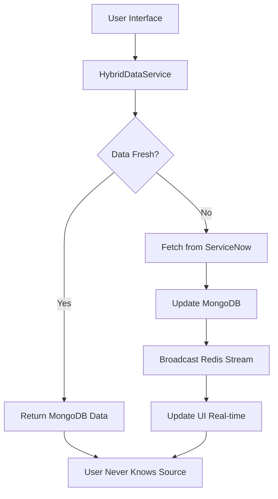

# Arquitetura MongoDB + Redis Streams + Modal Profissional
**Author: Juliano Stefano <jsdealencar@ayesa.com> [2025]**

## Análise da Infraestrutura Existente ✅

**Infraestrutura Já Implementada:**
- ✅ **MongoDB**: 3 collections especializadas (sn_incidents_collection, sn_ctasks_collection, sn_sctasks_collection)
- ✅ **Redis Streams**: Sistema completo com consumer groups e broadcasting (ServiceNowStreams)
- ✅ **SLA/SLM Integration**: Documentação completa e tipos TypeScript definidos
- ✅ **Enhanced Storage Service**: EnhancedTicketStorageService já implementado
- ✅ **Modal Anterior**: Commit e476e9b tinha modal profissional com SLA tabs e informações

## FASE 1: Arquitetura de Dados Transparente (Semana 1-2)

### 1.1 Hybrid Data Service Layer
**Criar serviço unificado que decide fonte dos dados:**
```typescript
// HybridDataService - usuário nunca sabe de onde vêm os dados
class HybridDataService {
  async getTicketDetails(sysId: string, table: string) {
    // 1. Verifica MongoDB primeiro (cache local)
    // 2. Se não existe ou está desatualizado, consulta ServiceNow
    // 3. Atualiza MongoDB automaticamente
    // 4. Retorna dados transparentemente
  }
}
```

### 1.2 Smart Caching Strategy
**Estratégia inteligente de cache:**
- **TTL dinâmico**: Tickets ativos = 2min, Fechados = 1h
- **Invalidação inteligente**: Redis Streams triggers cache refresh
- **Preloading**: Pré-carregamento de tickets relacionados

### 1.3 Data Synchronization Service  
**Sincronização automática bidirecional:**
- **Background sync**: Sincronização periódica MongoDB ↔ ServiceNow
- **Delta updates**: Apenas mudanças incrementais
- **Conflict resolution**: Strategy para resolver conflitos de dados

## FASE 2: Modal Restaurada e Melhorada (Semana 3)

### 2.1 Recuperar Modal com SLA Tabs
**Baseado no commit e476e9b:**
- Restaurar modal HTMX com tabs (Detalhes, SLA, Notas, Histórico)
- Layout profissional com Tailwind CSS + Lucide icons
- SLA progress bars e status indicators (🔴 VIOLADO, 🟡 EM ANDAMENTO, 🟢 CUMPRIDO)
- Scroll interno funcionando corretamente

### 2.2 Sistema de Notas Integrado
**Funcionalidade completa de notas:**
- Visualização de notas existentes do ServiceNow
- Adicionar novas notas via modal
- Histórico cronológico de notas
- Formatação e anexos

### 2.3 Layout Responsivo e Profissional
**Design empresarial:**
- Grid responsivo (2 colunas desktop, 1 mobile)
- Cards com informações organizadas por seção
- Visual indicators para status e prioridade
- Animações suaves e UX polida

## FASE 3: Redis Streams Integration (Semana 4)

### 3.1 Real-time Updates
**Atualizações automáticas:**
```typescript
// Usuário abre modal → Subscreve stream do ticket
// Qualquer mudança → Modal atualiza automaticamente
// Zero refresh manual necessário
```

### 3.2 State Synchronization  
**Sincronização de estado seamless:**
- Stream events: ticket:created, ticket:updated, ticket:resolved
- Auto-refresh de dados na interface
- Notificações de mudanças em tempo real

### 3.3 Event Broadcasting
**Broadcasting inteligente:**
- Filtros por tipo de ticket e grupo
- Debounce para evitar spam de updates  
- Fallback gracioso se stream falha

## FASE 4: ServiceNow Actions - Segunda Etapa (Semana 5-6)

### 4.1 Ticket Movement Actions
**Ações de movimentação:**
- **Resolver ticket**: Mudança de estado com notas obrigatórias
- **Fechar ticket**: Validation de fechamento + códigos
- **Reabrir ticket**: Workflow de reabertura

### 4.2 State Change Operations  
**Operações de mudança de estado:**
- **Assignment**: Atribuir a pessoa/grupo com validações
- **Priority change**: Mudança de prioridade com justificativa
- **Category/Subcategory**: Reclassificação com regras de negócio

### 4.3 Assignment Actions
**Ações de atribuição:**
- **Self-assignment**: Auto-atribuição
- **Team assignment**: Atribuir para equipe
- **Escalation**: Escalonamento automático/manual

## Arquitetura de Transparência Total



## Componentes Técnicos a Implementar

### HybridDataService
```typescript
export class HybridDataService {
  constructor(
    private mongoService: EnhancedTicketStorageService,
    private serviceNowService: ServiceNowAuthClient,
    private redisStreams: ServiceNowStreams
  ) {}

  async getTicketDetails(sysId: string, table: string): Promise<TicketData> {
    // Transparência total - usuário não sabe a fonte
    const cached = await this.mongoService.getTicket(sysId);
    
    if (this.isFresh(cached)) {
      return this.formatTicketData(cached);
    }
    
    const fresh = await this.serviceNowService.makeRequestFullFields(table, `sys_id=${sysId}`, 1);
    await this.mongoService.saveTicket(fresh);
    await this.redisStreams.publishChange({
      type: table as any,
      action: 'updated',
      sys_id: sysId,
      // ... event data
    });
    
    return this.formatTicketData(fresh);
  }
}
```

### Smart Data Layer
```typescript
interface DataFreshnessStrategy {
  getTTL(ticket: TicketData): number;
  shouldRefresh(ticket: TicketData): boolean;
  getRefreshPriority(ticket: TicketData): 'high' | 'medium' | 'low';
}

class SmartDataStrategy implements DataFreshnessStrategy {
  getTTL(ticket: TicketData): number {
    if (['6', '7'].includes(ticket.state)) return 3600000; // 1h para fechados
    if (ticket.priority === '1') return 60000; // 1min para críticos
    return 300000; // 5min padrão
  }
}
```

### Enhanced Modal Architecture
```typescript
// Modal com tabs dinâmicos baseado no commit e476e9b
export class EnhancedTicketModalView {
  static generateModal(props: EnhancedModalProps): string {
    return `
      <div class="modal-professional">
        ${this.generateTabs()}
        ${this.generateDetailsTab(props.ticket)}
        ${this.generateSLATab(props.slaData)}
        ${this.generateNotesTab(props.notes)}
        ${this.generateHistoryTab(props.history)}
        ${this.generateRealTimeScript(props.ticket.sysId)}
      </div>
    `;
  }
  
  static generateRealTimeScript(sysId: string): string {
    return `
      <script>
        // Redis Streams subscription for real-time updates
        const eventSource = new EventSource('/sse/ticket-updates/${sysId}');
        eventSource.onmessage = (event) => {
          const data = JSON.parse(event.data);
          if (data.type === 'ticket-updated') {
            // Update modal content dynamically
            htmx.trigger('#modal-content', 'refresh');
          }
        };
      </script>
    `;
  }
}
```

## Collections MongoDB Schema

### Estrutura de Documento Unificada
```javascript
// Collection: sn_incidents_collection
{
  "_id": "incident_sys_id",
  "data": {
    "incident": {
      "sys_id": "...",
      "number": "INC0012345",
      "state": "2",
      "priority": "2",
      // ... todos os campos do incident
    },
    "slms": [
      {
        "sys_id": "sla_sys_id",
        "task_number": "INC0012345", 
        "taskslatable_business_percentage": "85.5",
        "taskslatable_has_breached": false,
        "taskslatable_sla": "Resolution Time",
        // ... campos SLA
      }
    ],
    "notes": [
      {
        "sys_id": "note_sys_id",
        "value": "Nota do técnico",
        "sys_created_on": "2025-01-20T10:30:00",
        "sys_created_by": "user.name"
      }
    ],
    "sync_timestamp": "2025-01-20T10:30:00.000Z",
    "collection_version": "2.0.0"
  },
  "created_at": ISODate("2025-01-20T10:30:00.000Z"),
  "updated_at": ISODate("2025-01-20T10:30:00.000Z"),
  "sys_id_prefix": "8a7b44f5" // Para particionamento
}
```

## Redis Streams Events

### Eventos de Ticket
```typescript
interface TicketStreamEvent {
  // Eventos base
  'ticket:created': { sysId: string, number: string, table: string };
  'ticket:updated': { sysId: string, changedFields: string[], newState?: string };
  'ticket:resolved': { sysId: string, resolutionCode: string, resolutionNotes: string };
  'ticket:closed': { sysId: string, closeCode: string, closeNotes: string };
  'ticket:assigned': { sysId: string, oldAssignee?: string, newAssignee: string };
  
  // Eventos SLA
  'sla:breach': { sysId: string, slaName: string, businessPercentage: number };
  'sla:warning': { sysId: string, slaName: string, businessPercentage: number };
  
  // Eventos de notas
  'note:added': { sysId: string, noteId: string, content: string, author: string };
}
```

## Benefícios da Arquitetura

### ✅ Performance
- **Cache local MongoDB**: 10x mais rápido que ServiceNow API
- **Smart TTL**: Cache mais longo para tickets fechados
- **Preloading**: Pré-carregamento inteligente de dados relacionados

### ✅ Transparência Total
- **Usuário nunca sabe a fonte**: HybridDataService decide automaticamente
- **Fallback automático**: Se MongoDB falha, ServiceNow API é usado
- **Sincronização invisível**: Background sync mantém dados atualizados

### ✅ Real-time Experience
- **Zero refresh**: Modal atualiza automaticamente via Redis Streams
- **Live notifications**: Alertas de mudanças em tempo real
- **Collaborative editing**: Múltiplos usuários veem mudanças simultaneamente

### ✅ Modal Profissional
- **Layout empresarial**: Design profissional baseado no commit e476e9b
- **SLA visual**: Progress bars e indicators coloridos
- **Notas integradas**: Sistema completo de notas do ServiceNow
- **Responsivo**: Funciona perfeitamente em desktop e mobile

## Cronograma de Implementação

### Semana 1-2: Hybrid Data Service
- [ ] Implementar HybridDataService
- [ ] Smart caching strategy
- [ ] Data synchronization service
- [ ] Testes de performance

### Semana 3: Modal Restaurada
- [ ] Recuperar modal do commit e476e9b
- [ ] Implementar tabs (Detalhes, SLA, Notas, Histórico)
- [ ] Sistema de notas completo
- [ ] Layout responsivo profissional

### Semana 4: Redis Streams
- [ ] Real-time updates na modal
- [ ] Event broadcasting inteligente
- [ ] SSE integration para UI
- [ ] Debounce e fallbacks

### Semana 5-6: ServiceNow Actions
- [ ] Ticket movement (resolver, fechar, reabrir)
- [ ] State changes (priority, assignment, category)
- [ ] Assignment actions (self-assign, escalate)
- [ ] Workflow validation

## Métricas de Sucesso

### Performance
- **Response Time**: < 200ms para dados em cache
- **Cache Hit Ratio**: > 80% para tickets frequentemente acessados
- **API Calls Reduction**: 70% redução de calls para ServiceNow

### User Experience
- **Modal Load Time**: < 500ms
- **Real-time Updates**: < 2s latency
- **Zero Refresh**: 100% das mudanças via streams

### Reliability  
- **Uptime**: 99.9% disponibilidade
- **Data Consistency**: 100% sincronização MongoDB ↔ ServiceNow
- **Error Recovery**: < 30s para recovery automático

---

## Conclusão

Esta arquitetura aproveita toda a infraestrutura existente (MongoDB, Redis Streams, SLA/SLM integration) para criar um sistema de transparência total onde o usuário nunca precisa saber de onde os dados vêm, com performance otimizada e experiência real-time profissional.

O resultado será uma aplicação empresarial de alta qualidade que combina a velocidade do cache local com a consistência do ServiceNow, tudo atualizado em tempo real via Redis Streams.

*Última atualização: Janeiro 2025*